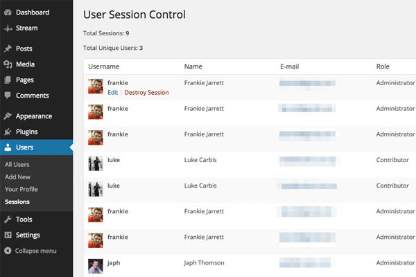
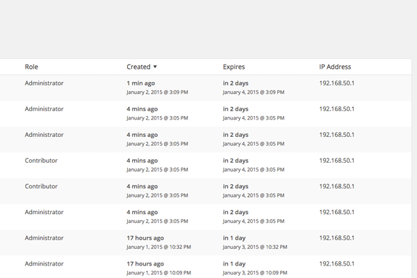

<!-- DO NOT EDIT THIS FILE; it is auto-generated from readme.txt -->
# User Session Control

View and manage all active user sessions in a custom admin screen.

**Contributors:** [fjarrett](http://profiles.wordpress.org/fjarrett)  
**Tags:** [login](http://wordpress.org/plugins/tags/login), [users](http://wordpress.org/plugins/tags/users), [security](http://wordpress.org/plugins/tags/security), [sessions](http://wordpress.org/plugins/tags/sessions)  
**Requires at least:** 4.1  
**Tested up to:** 4.1  
**Stable tag:** trunk (master)  
**License:** [GPLv2 or later](http://www.gnu.org/licenses/gpl-2.0.html)  

 

## Description ##

WordPress 4.1 "Dinah" introduced the awesome power of user session management.

However, you are limited to only being able to destroy your own sessions, and you cannot destroy them individually.

This plugin allows Administrators to view and manage all sessions by all users on an individual basis.

* Displays a custom "God view" screen of all active user sessions
* Sort sessions by user, role, creation date, expiry date or IP address
* Quickly and easily destroy sessions you think may be a security risk

**Development of this plugin is done [on GitHub](https://github.com/fjarrett/user-session-control). Pull requests welcome. Please see [issues reported](https://github.com/fjarrett/user-session-control/issues) there before going to the plugin forum.**

## Screenshots ##

### The familiar list table view allows you to view and manage all active user sessions easily.

### All columns are sortable in ascending and descending order so you can quickly find the sessions you are looking for.

## Changelog ##

### 0.1.0 - January 1, 2015 ###
* Initial release

Props [fjarrett](https://profiles.wordpress.org/fjarrett/)

